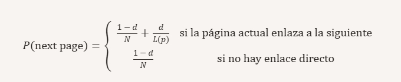
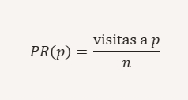
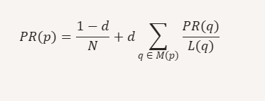
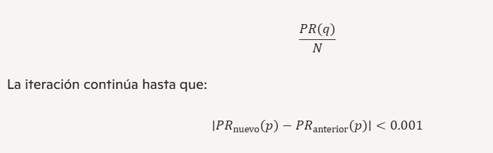

---

# **PageRank — CS50 AI**

Este proyecto implementa el algoritmo **PageRank**, que calcula la importancia de cada página dentro de un corpus HTML usando dos métodos: **muestreo** y **iteración matemática**.

---

##  **Modelo de Transición**

El usuario navega siguiendo este modelo:

\[
P(\text{next page}) =
\begin{cases}
\frac{1 - d}{N} + \frac{d}{L(p)} & \text{si la página actual enlaza a la siguiente} \\
\frac{1 - d}{N} & \text{si no hay enlace directo}
\end{cases}
\]

Donde:

- \( d \) = damping factor (0.85)  
- \( N \) = número total de páginas  
- \( L(p) \) = enlaces salientes de la página actual  

---

##  **PageRank por Muestreo**

Se simula un usuario navegando durante \( n \) pasos.  
El PageRank estimado es:

\[
PR(p) = \frac{\text{visitas a } p}{n}
\]

---

## **PageRank por Iteración**

El valor de cada página se actualiza hasta converger:

\[
PR(p) = \frac{1 - d}{N} + d \sum_{q \in M(p)} \frac{PR(q)}{L(q)}
\]

Donde:

- \( M(p) \) = páginas que enlazan a \( p \)  
- Si una página \( q \) no tiene enlaces, se reparte su PR entre todas las páginas:

\[
\frac{PR(q)}{N}
\]

La iteración continúa hasta que:

\[
|PR_{\text{nuevo}}(p) - PR_{\text{anterior}}(p)| < 0.001
\]

---

##  **Contenido**

- `pagerank.py` — implementación completa  
- `corpus0/`, `corpus1/`, `corpus2/` — conjuntos de prueba  

---

---

Si quieres, puedo generar una versión **más técnica**, **más corta**, o **con diagramas matemáticos**.
